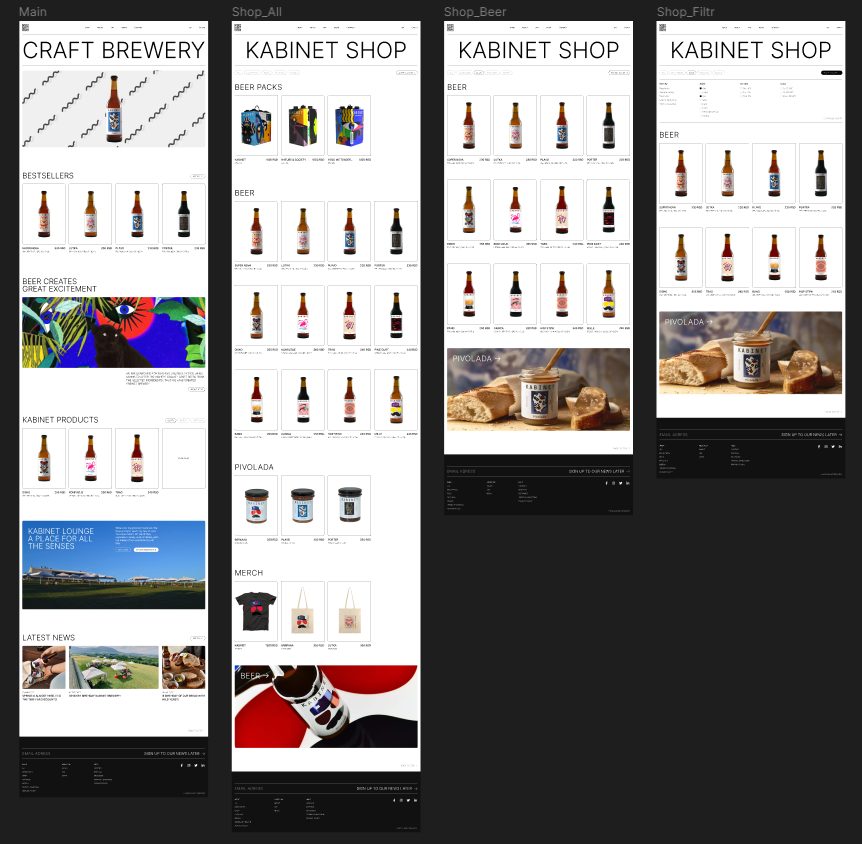

# 

# Pet project - website "Kabinet Brewery"
The purpose of the project is to demonstrate my frontend skills. I'm based in Czech Republic and of course this site is about beer :beers:

## Demo
Here is a working live demo :  

## Functions
- slider
- preview modules
- sorting
- filters
- tab buttons
- imitation of database in constants file

## For installing locally
- [OS Panel (Open Server) 5.4.3](https://ospanel.io/) or another local web server

## Designed by
Link to Figma : 